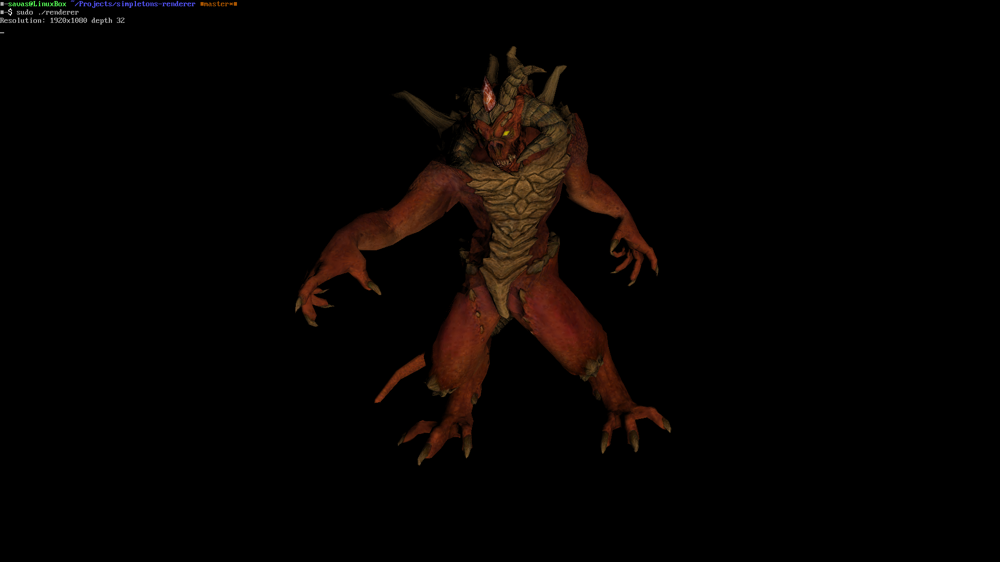

# Simpleton's renderer
Simplistic software renderer that works directly on Linux framebuffer.
This is basically just me following 
[this wonderful repo](https://github.com/ssloy/tinyrenderer) as a guide.
`tgaimage` and (most of) `model` implementations are taken directly from that repo.
I plan on redoing the model myself sometime later.

## Renders

Model does not belong to me, nor do I have the permission to redistribute it, however [this guy can](https://github.com/ssloy/tinyrenderer/tree/master/obj/diablo3_pose).

## Running
This is written with Linux in mind, so it will not work on Windows and most likely
MacOS. The application draws directly on the framebuffer, so you'll need to switch
to a TTY as otherwise X or Wayland will prevent from anything being displayed. You'll
also need to run it with sudo as it mmaps `/dev/fb0`.

## Todos
- I tanked the performance after rewriting the vectors 
  + Potentially make them mutable to save on the amount of objects created?
  + Try to change the vector implementation to not use CRTP although I have no 
    idea why that would improve anything.
- Add specular maps
- Add emission maps

## License
This project is licensed under MIT License - see [LICENSE](LICENSE) file for details.
